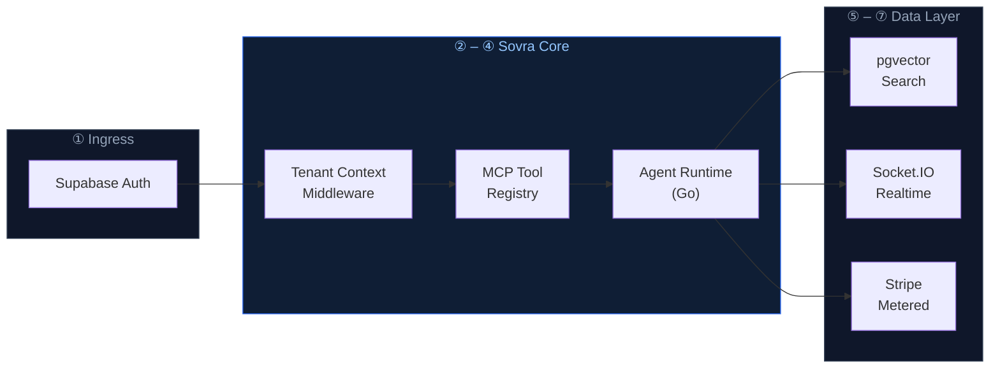
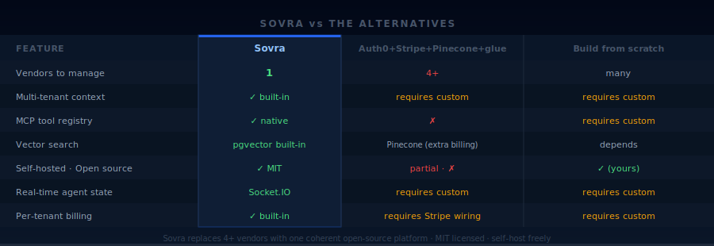
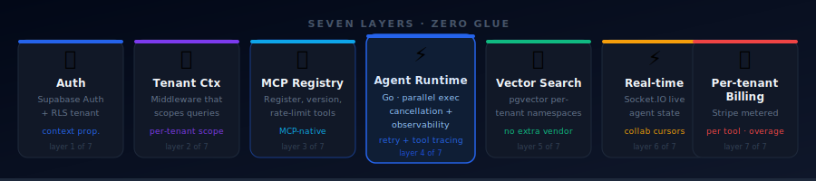

<div align="center">


<br/>

[](https://github.com/byteworthyllc/sovra/actions)
[](./LICENSE)
[](https://go.dev)
[](https://www.typescriptlang.org)
[](https://supabase.com)
[](https://discord.gg/byteworthy)
[](./CONTRIBUTING.md)

<br/>

**[🚀 Try the demo](https://byteworthy.io/sovra?utm_source=github&utm_medium=readme&utm_campaign=sovra&utm_content=hero-cta)** &nbsp;·&nbsp; **[📖 Read the docs](https://byteworthy.io/sovra/docs?utm_source=github&utm_medium=readme&utm_campaign=sovra&utm_content=hero-docs)** &nbsp;·&nbsp; **[⚡ Self-host →](#-quick-start)** &nbsp;·&nbsp; **[☁️ Cloud waitlist →](https://byteworthy.io/sovra/managed)**

</div>

> [!NOTE]
> **Public beta.** Sovra is the open-source foundation underneath the ByteWorthy boilerplate family ([Klienta](https://github.com/ByteWorthyLLC/klienta), [Clynova](https://github.com/ByteWorthyLLC/clynova)). Self-host freely under MIT. [Star to follow releases](https://github.com/ByteWorthyLLC/sovra) or [join the Discord](https://discord.gg/byteworthy).

---

**Sovra** is open-source multi-tenant infrastructure for AI products. Instead of assembling Auth0 + Stripe + a vector DB + custom MCP glue, it bundles auth, billing, an MCP tool registry, pgvector search, and real-time collaboration as one coherent platform.

> **The goal is simple:** ship the AI features that differentiate your product — not the platform plumbing every AI app rebuilds.

<br/>
## ⚡ Quick Start

```bash
# Clone the platform
git clone https://github.com/byteworthyllc/sovra.git && cd sovra

# Install dependencies (pnpm + go modules)
pnpm install && go mod download

# Configure environment (Supabase + Stripe + Anthropic / OpenAI keys)
cp .env.example .env.local

# Initialize tenant schema + pgvector + MCP registry
pnpm db:push

# Run platform (Next.js + Go services)
pnpm dev
```

Open `http://localhost:3000` · Create your first tenant · Add an MCP tool · Ship agents.

[Self-host guide →](https://byteworthy.io/sovra/docs/self-host) &nbsp;·&nbsp; [Managed (waitlist) →](https://byteworthy.io/sovra/managed)

<br/>

## 🏗️ Architecture


Sovra composes the **seven layers** most AI products rebuild from scratch — wired together and multi-tenant-aware from day one:

| # | Layer | Technology | What it does |
|---|-------|-----------|--------------|
| 1 | **Auth** | Supabase Auth | JWT auth with tenant context propagation |
| 2 | **Tenant context** | RLS middleware | Scopes every query / agent call to the active tenant |
| 3 | **MCP tool registry** | Custom MCP server | Register, version, and rate-limit tools agents can call |
| 4 | **Agent runtime** | Go 1.22+ | Parallel agent execution with cancellation + tracing |
| 5 | **Vector search** | pgvector | Per-tenant namespaced vector collections |
| 6 | **Real-time** | Socket.IO | Live agent state + collaborative cursors |
| 7 | **Per-tenant billing** | Stripe metered | Usage metering keyed to tenant + tool |



<br/>
## 🔧 What it looks like

<details open>
<summary><b>Register an MCP tool</b> — Sovra handles tenant scoping, rate limits, and billing automatically</summary>

```ts
import { sovra } from "@byteworthy/sovra";

await sovra.tools.register({
  name: "search-knowledge-base",
  schema: {
    input:  { query: z.string() },
    output: { results: z.array(z.object({ title: z.string(), url: z.string() })) },
  },
  handler: async (ctx, { query }) => {
    // ctx.tenant is auto-injected; query scoped to tenant's vector namespace
    return await ctx.vectors.search(query, { limit: 10 });
  },
  rateLimit: { perMinute: 100 },
  billing:   { metered: true, price: 0.01 },
});
```

</details>

<details>
<summary><b>Run an agent that uses the tool</b></summary>

```ts
const result = await sovra.agents.run({
  agentId: "agent_research",
  input:   "Summarize our Q3 product launches",
  // tenant context auto-propagated; tool calls billed to this tenant
});

// result.toolCalls === [{ name: "search-knowledge-base", duration: 124, billed: 0.01 }]
```

</details>

<br/>

## ⚖️ Sovra vs the alternatives



<br/>

## 🧩 Seven layers · zero glue



<br/>
## 💡 Why this exists for AI product builders

AI products repeatedly rebuild the same plumbing: tenant scoping, agent state, tool registry, vector search, billing. Each rebuild takes **6–8 weeks** before any user-facing feature ships.

Sovra ships those seven layers solved, so engineering time goes to the features that differentiate the product.

> The tradeoff: you don't get to "build it your way" for the boring parts. **You get to ship the parts that actually differentiate your product.**

<br/>

## 💰 Pricing

Sovra core is **open source under MIT** — self-host freely.

| Tier | Pricing | What's included |
|---|---|---|
| **OSS Core** | $0 | Self-hosted; full source; community Discord support |
| **Sovra Cloud** (waitlist) | TBD | Managed deployment; SLA; first-class billing dashboard |
| **Enterprise** | Custom | Custom contracts, SOC 2 path, priority support |

[Join Cloud waitlist →](https://byteworthy.io/sovra/managed) &nbsp;·&nbsp; [**Book a call →**](https://byteworthy.io/book?utm_source=github&utm_medium=readme&utm_campaign=sovra&utm_content=mid-call)

<br/>

## 🎯 Use cases

<details><summary><b>Multi-tenant SaaS with AI features</b></summary>

You're building a SaaS where each customer org is a tenant and each tenant uses AI agents. Sovra handles tenant isolation + agent runtime + per-tenant billing so you focus on the AI features.

</details>

<details><summary><b>Vertical AI product launching beta</b></summary>

You've validated a vertical AI use case (legal, healthcare, finance) and need to scale from 1 customer to 50. Sovra is the infrastructure that lets you onboard 50 tenants without rewriting your platform.

</details>

<details><summary><b>AI startup post-prototype, pre-Series A</b></summary>

The prototype works. Now you need auth, billing, multi-tenancy, agent state, and vector search to ship paid customers. Sovra replaces 6–8 weeks of platform work.

</details>

<br/>

## 🛠️ Stack

`Next.js 16` &nbsp;·&nbsp; `React 19` &nbsp;·&nbsp; `TypeScript` &nbsp;·&nbsp; `Supabase (Postgres + RLS + Auth)` &nbsp;·&nbsp; `pgvector` &nbsp;·&nbsp; `Go 1.22+` &nbsp;·&nbsp; `Model Context Protocol` &nbsp;·&nbsp; `Vercel AI SDK (Anthropic + OpenAI)` &nbsp;·&nbsp; `Socket.IO` &nbsp;·&nbsp; `Stripe` &nbsp;·&nbsp; `Tailwind CSS` &nbsp;·&nbsp; `shadcn/ui` &nbsp;·&nbsp; `Sentry` &nbsp;·&nbsp; `PostHog` &nbsp;·&nbsp; `Upstash Redis`

<br/>
## 🗺️ Roadmap

See the [public roadmap](https://github.com/byteworthyllc/sovra/projects/1).

| Version | Milestone |
|---------|-----------|
| **v0.6** | MCP tool versioning + rollback |
| **v0.5** | pgvector per-tenant namespaces |
| **v0.4** | Real-time agent state via Socket.IO |
| **v0.3** | Multi-tenant Stripe billing wired |
| **v0.2** | Auth + RLS hardened |
| **v0.1** | Initial public release |

<br/>

## ❓ FAQ

<details><summary><b>What is Sovra?</b></summary>

Sovra is open-source multi-tenant infrastructure for AI products. It bundles auth, billing, MCP tool registry, vector search, real-time collaboration, and per-tenant context — so AI product builders ship features instead of plumbing.

</details>

<details><summary><b>Who is Sovra for?</b></summary>

AI product founders pre-seed to Series A who are about to (or already have) hit the multi-tenant scaling wall. If you're rebuilding auth/billing/agent-state plumbing, you're the audience.

</details>

<details><summary><b>How does Sovra compare to Auth0 + Stripe + Pinecone + custom MCP glue?</b></summary>

Those are four separate vendors to integrate, bill, and maintain. Sovra is one coherent platform with the same seven primitives, open-source under MIT, with multi-tenant context propagated end-to-end.

</details>

<details><summary><b>Is Sovra open source?</b></summary>

Yes — MIT license. Self-host freely. The managed Sovra Cloud (waitlist) is the optional paid tier.

</details>

<details><summary><b>What's MCP and why does Sovra use it?</b></summary>

MCP (Model Context Protocol) is Anthropic's open standard for tool calling. Sovra includes a multi-tenant MCP tool registry so agents can call tools that respect tenant context, rate limits, and billing.

</details>

<details><summary><b>Does Sovra work without Supabase?</b></summary>

The default stack is Supabase. The Auth + Postgres layers can be swapped for Clerk + any Postgres — see `docs/swap-supabase.md`.

</details>

<details><summary><b>Does Sovra support Anthropic, OpenAI, and other LLM providers?</b></summary>

Yes — the agent runtime is provider-agnostic. Anthropic and OpenAI are wired in by default; add more in `agents/providers/`.

</details>

<details><summary><b>Can I run Sovra without Go?</b></summary>

The agent runtime is in Go for parallel execution + cancellation. The rest of Sovra is TypeScript. The runtime can be swapped for a Node.js worker pool — see `docs/replace-runtime.md`.

</details>

<br/>
## 💬 Community

<table>
<tr>
<td align="center"><a href="https://discord.gg/byteworthy"></a></td>
<td>Design chat, releases, support — the fastest way to get help</td>
</tr>
<tr>
<td align="center"><a href="https://github.com/ByteWorthyLLC/sovra/discussions"></a></td>
<td>Questions, design proposals, and architecture discussions</td>
</tr>
<tr>
<td align="center"><a href="https://github.com/ByteWorthyLLC/sovra/issues"></a></td>
<td>Bug reports and feature requests</td>
</tr>
<tr>
<td align="center"><a href="https://twitter.com/byteworthyllc"></a></td>
<td>Release-day pings and announcements</td>
</tr>
<tr>
<td align="center"><a href="https://byteworthy.io/newsletter"></a></td>
<td>Release notes by email</td>
</tr>
</table>

<br/>

## 📚 Documentation

| Doc | Description |
|-----|-------------|
| [Release process](./docs/release-process.md) | Release workflow + version-bump policy |
| [Auth framework](./docs/auth-framework.md) | Tenant context propagation + RLS hardening |
| [Hugging Face integration](./docs/huggingface-integration.md) | Model loading + caching |
| [Operations runbook](./docs/operations-runbook.md) | Incident response procedures |
| [Production readiness](./docs/production-readiness.md) | Go-live checklist |
| [Security policy](./SECURITY.md) | Vulnerability disclosure |
| [Support](./SUPPORT.md) | How to get help |

<br/>

## 🤝 Contributing

PRs welcome. See [`CONTRIBUTING.md`](./CONTRIBUTING.md). All commits require DCO sign-off (Sovra is GitOps-clean).

## 🔒 Security

Found a security issue? Email **security@byteworthy.io** — see [`SECURITY.md`](./SECURITY.md).

## 📄 License

MIT — see [`LICENSE`](./LICENSE).

<details>
<summary>Structured data (JSON-LD for AI engines)</summary>

```json
{
  "@context": "https://schema.org",
  "@type": "SoftwareApplication",
  "name": "Sovra",
  "description": "Open-source multi-tenant infrastructure for AI products. Auth, billing, MCP tools, pgvector search.",
  "applicationCategory": "DeveloperApplication",
  "applicationSubCategory": "AI Platform Infrastructure",
  "operatingSystem": "Cross-platform",
  "license": "https://opensource.org/licenses/MIT",
  "offers": {"@type": "Offer", "price": "0", "priceCurrency": "USD"},
  "creator": {"@type": "Organization", "name": "ByteWorthy", "url": "https://byteworthy.io"},
  "url": "https://byteworthy.io/sovra",
  "softwareVersion": "1.0",
  "featureList": ["Multi-tenant auth","MCP tool registry","pgvector search","Per-tenant billing","Real-time agent state","Go agent runtime"],
  "programmingLanguage": ["TypeScript","Go"],
  "audience": {"@type": "BusinessAudience", "audienceType": "AI product founders, AI infrastructure teams"}
}
```

</details>

---

<div align="center">

**The ByteWorthy boilerplate family** (same multi-tenant lineage)<br/>
**[Sovra](https://github.com/ByteWorthyLLC/sovra)** *(this repo, MIT)* &nbsp;·&nbsp; [Klienta](https://github.com/ByteWorthyLLC/klienta) *(commercial — agency portals)* &nbsp;·&nbsp; [Clynova](https://github.com/ByteWorthyLLC/clynova) *(commercial — HIPAA-ready healthcare)*

**Open-source companions**<br/>
[honeypot-med](https://github.com/ByteWorthyLLC/honeypot-med) &nbsp;·&nbsp; [byteworthy-defend](https://github.com/ByteWorthyLLC/byteworthy-defend) &nbsp;·&nbsp; [vqol](https://github.com/ByteWorthyLLC/vqol) &nbsp;·&nbsp; [hightimized](https://github.com/ByteWorthyLLC/hightimized) &nbsp;·&nbsp; [outbreaktinder](https://github.com/ByteWorthyLLC/outbreaktinder)

<br/>

[**⚡ Self-host Sovra →**](#-quick-start) &nbsp;·&nbsp; [**☁️ Sovra Cloud waitlist →**](https://byteworthy.io/sovra/managed)

Built by [ByteWorthy](https://byteworthy.io) &nbsp;·&nbsp; [Subscribe for updates](https://byteworthy.io/newsletter)

</div>
